#### 什么是光线追踪(Ray Tracing)?

In 3D computer graphics, ray tracing is a technique for modeling light transport for use in a wide variety of rendering algorithms for generating digital images. [(from wiki)](https://en.wikipedia.org/wiki/Ray_tracing_(graphics))

光线追踪能提供给我们更加好看的图片，在概念上也比起其他渲染技术更容易理解，这也是为什么要讲光追的理由。

利用光线追踪技术生成出来的图像几乎可以达到以假乱真的程度，现在被广泛应用于电影制作（离线渲染）和游戏（实时渲染）中。

    
     
    
以假乱真的效果

    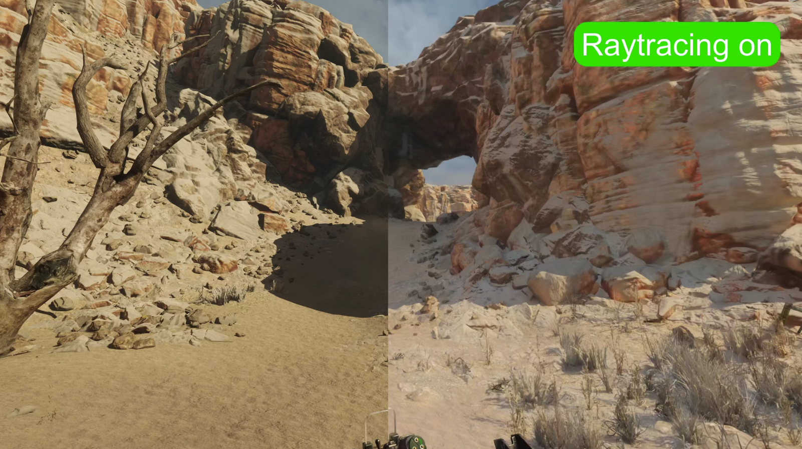 
     
    
光追关(左) 光追开(右)

我们的目标是简要地介绍光线追踪的技术，从一张最简单的图开始，一步一步添加细节，完成一张光线追踪风格的渲染。

    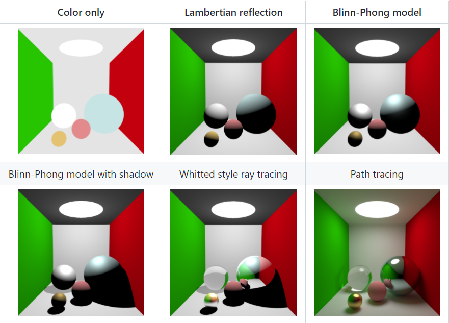
     
    
效果展示

#### 光线追踪的思想

我们能看到世界上的各个物体，是因为世界上有一些光源，光源发射出的光线，经过一系列的反射，最终被我们的眼睛所接受。

    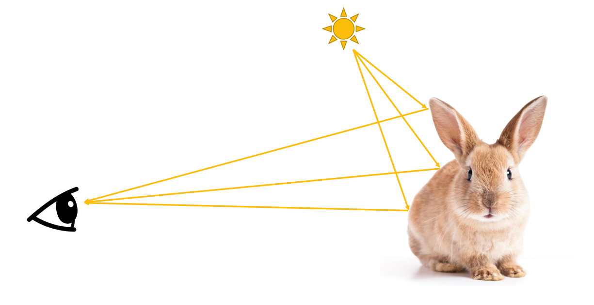
     
    
How do we see the world

在虚拟世界，我们同样也可以人为地设置一些光源，这些光反射到屏幕上，就在屏幕上显示出这些光的颜色，于是我们通过屏幕看到虚拟世界中的样子了。

    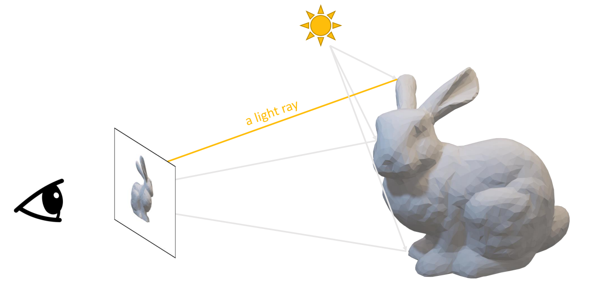
     
    
How do we see the virtual world

为了更方便处理这些光线，我们对虚拟世界的光线做一些假设：

+ 光线沿直线传播 (go in straight lines)
+ 光线之间互不干涉 (do not collide with each other)
+ 光路可逆 (are reversible)

于是我们可以认为，我们的眼睛往屏幕上的每个像素发射光线，然后看经过每个像素的光线经过了哪些反射找到了光源（或是无法找到光源）。最终把这些光线能看到的颜色绘制在屏幕上，就是我们看到的画面了。这个思想跟古希腊的一位哲学家 Empedocles 的理论很像，他的想法是类比触觉，之所以人能看到东西是因为人的眼睛能发射感知颜色的射线。

所以问题就变成了，屏幕上的每个像素看到了什么颜色。What color does the ray see?

    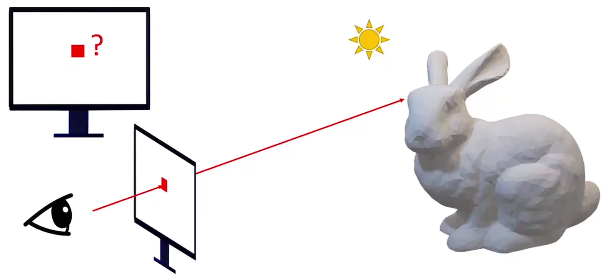
     
    
What is the color of this pixel?

#### Color Only

我们来尝试通过最简单的手段来解决这个问题。

通过一些简单的数学知识，我们能知道空间中一条射线与物体（比如说球）第一次相交于哪一点。

如果这一点是光源，就返回白色。如果是物体，就返回物体的颜色。如果什么都没打到，就认为是黑色。

    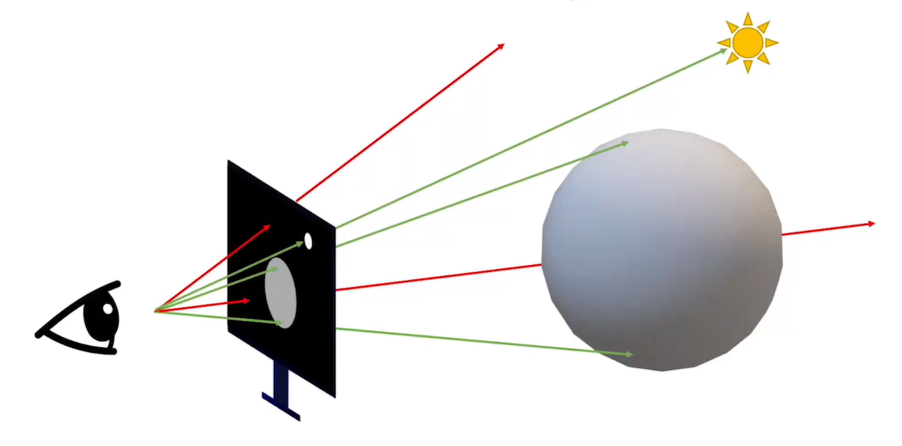
     
    

于是我们可以得到这样一幅画面：

    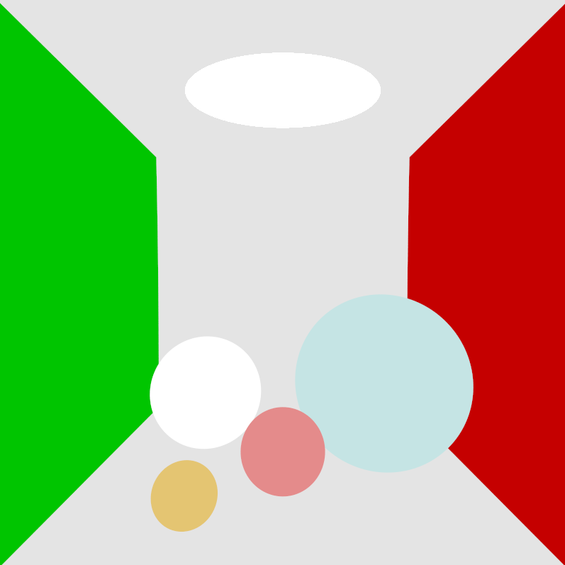
     
    

#### Brightness

我们没有办法在上图里看到更多的细节，比如每个球的材质等，只能知道它们在空间里的大致位置和基本的颜色。

这是因为我们平时看到的颜色，并不光只有物体表面的颜色，其实还有光线的强弱。

我们看到的其实相当于 $\text{color} \times \text{brightness}$。

    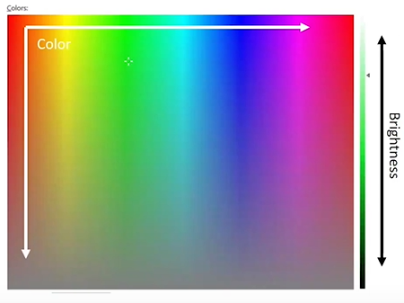
     
    

这就需要引入 Lambertian reflectance 模型来描述漫反射（Diffuse），有
$$
\text{brightness}=\cos(\theta)
$$
其中 $\theta$ 是入射光与物体表面法线的夹角。

    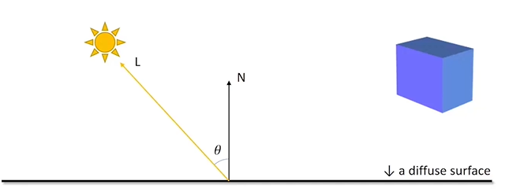
     
    

其实这个式子的含义很好理解也很符合直觉，垂直于物体表面看一定是最亮的，侧着看一定是更暗的，可以参考图右侧的长方体。

当我们把颜色乘以亮度了，我们就会得到一个看起来更像是 3D 的画面：

    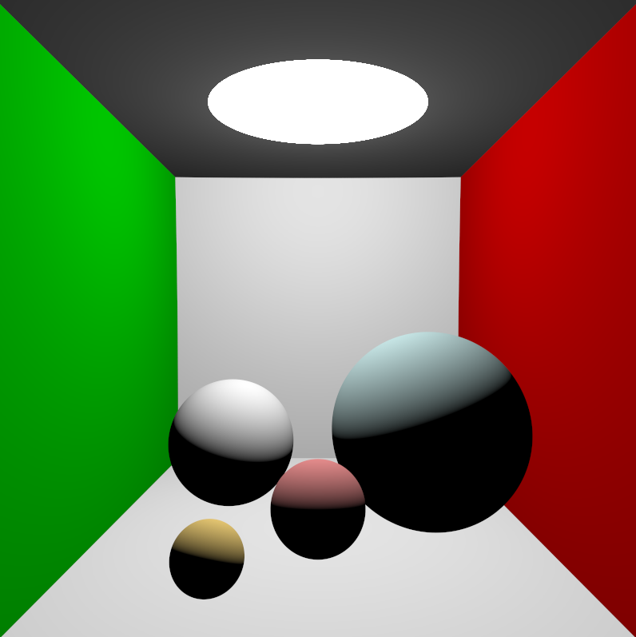
     
    

#### Specular

上图中我们还是没能解决材质的问题，每个球都看上去一样，这是因为我们缺少了镜面反射。

如果我们的视线越靠近反射光，那我们看到的反射就越强，所以反射光（高光 Specular）的强度可以这样描述：
$$
\text{Brightness}=(V\cdot R)^\alpha = (\cos(\theta))^\alpha
$$

其中 $\theta$ 是反射光和视线的夹角，$\alpha$ 是 hardness。

    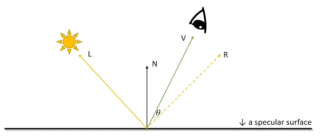
     
    

结合之前所讲的，就能得到传统的 Blinn-Phong 模型，我们可以通过调整高光的强弱来体现一个物体的材质

    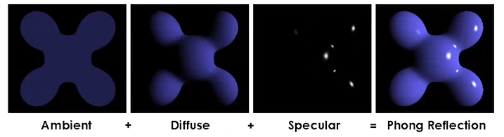
     
    

现在画面看起来更好看了一些

    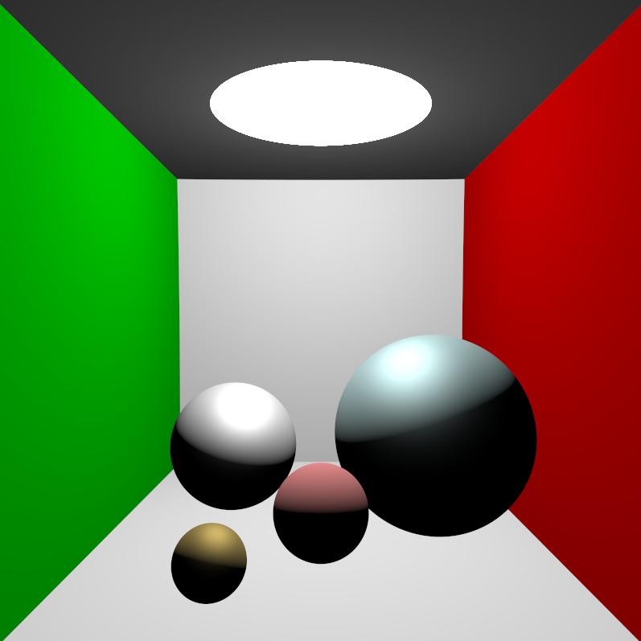
     
    

#### Shadows

还缺少了什么？上图中所有的球都看起来像是浮在空中，因为我们很大程度上依赖阴影来区分球的位置，所以我们需要阴影。

之前光线打到了物体表面就结束了，现在开始我们正式迈入光线追踪的领域。某个区域是不是阴影只需要检查一下这个区域能否看到光源就行了，看不到光源就返回黑色。

    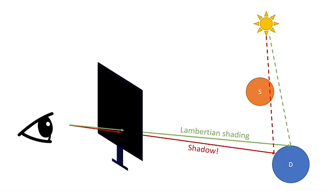
     
    

加上阴影之后的效果：

    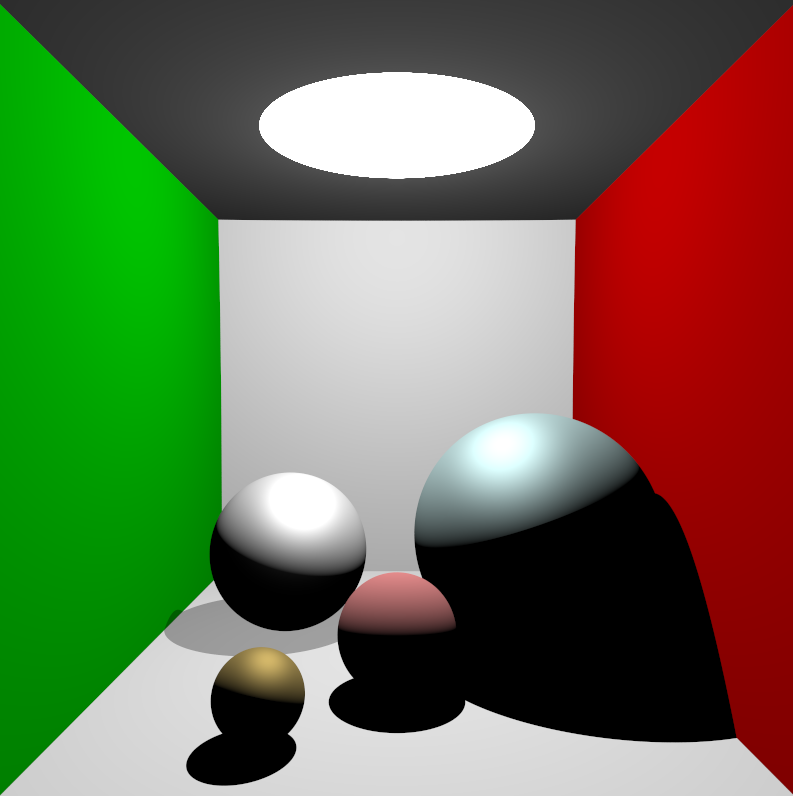
     
    

可以看到图中有个球的阴影并不是纯黑的，因为这个球是半透明的，为了达到这个效果只需要把黑的程度乘以一个系数就行了。

#### Whitted style ray tracing

只是按照 Blinn-Phong 模型来朴素的解决反射光仅仅解决的亮度，根本没达到我们想要的镜面效果。

所以我们可以进一步对反射光线进行追踪。

对于镜面物体的表面，我们可以从表面往反射光方向发射一条光线，询问反射光看到了什么颜色。这和我们之前解决的“某个像素是什么颜色”是个相同的问题，所以这其实是一个递归的过程。

最后我们把反射光看到的颜色和之前 Blinn-Phong 的颜色做一个混合（Blending），就是最后的颜色。

    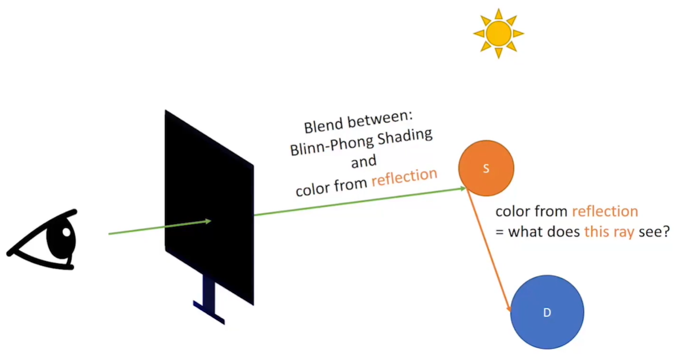
     
    

同样，对于介电质（既能透明又能反光的物质），我们需要发射两条光线，一条是折射光，一条是反射光。同样做一个混合。

    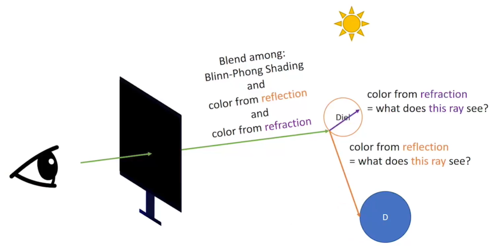
     
    

最终我们能得到一个 Whitted style 的效果：

    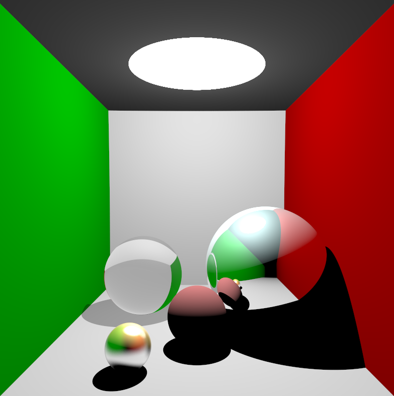
     
    

#### Path Tracing

尝试更进一步！之前的方法中，阴影是全黑的，但真实世界的阴影并不是这样的，其原因在于阴影区域可能接收到了其他物体的反射光，再由该区域漫反射把光线反射进眼中。而在之前的方法中，漫反射部分直接由 Lambertian reflectance 模型一笔带过了。

我们把这部分重新用光线追踪的方式重现出来。

类比一下镜面反射与折射的做法，从漫反射的表面随机往外发射若干条光线，把这些光线看到的颜色取个平均值，就是漫反射的颜色了。（式子就不详细解释了，道理和 Lambertian 模型其实是一样的）。

    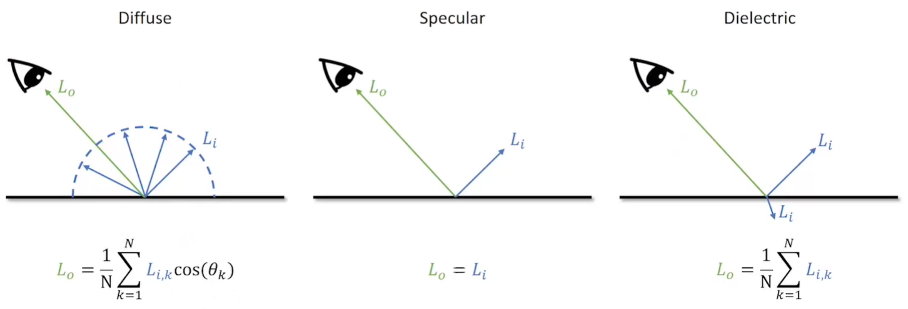
     
    

基于这个思想，就能得到以下的图像

    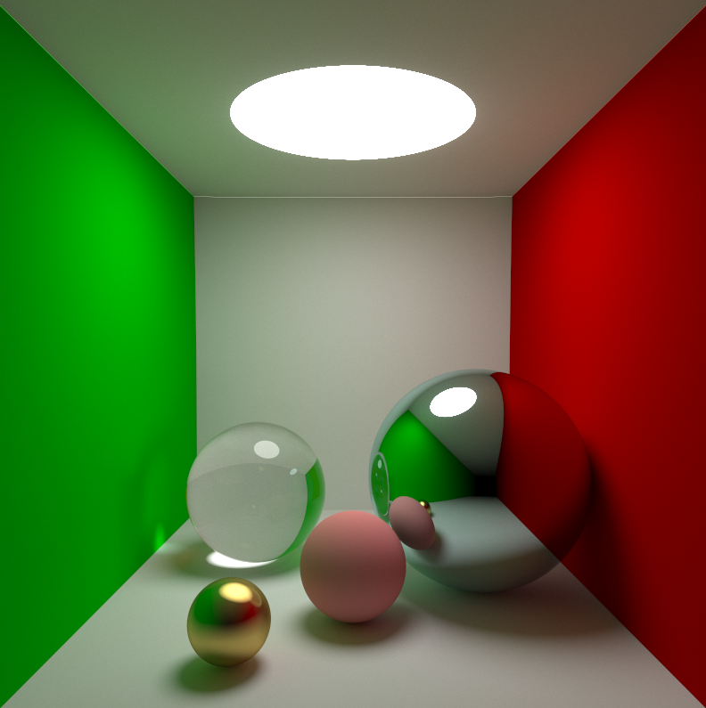
     
    

