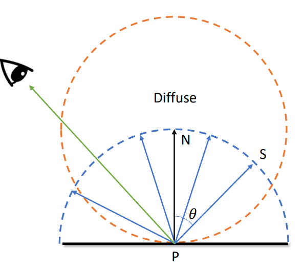
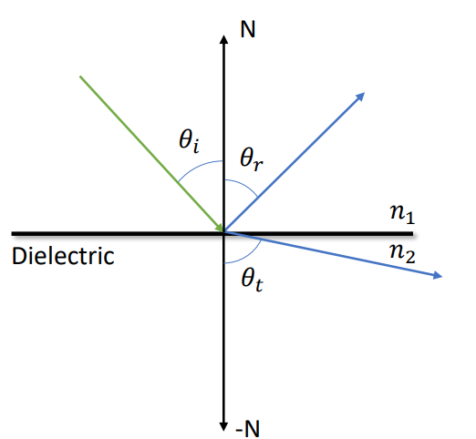
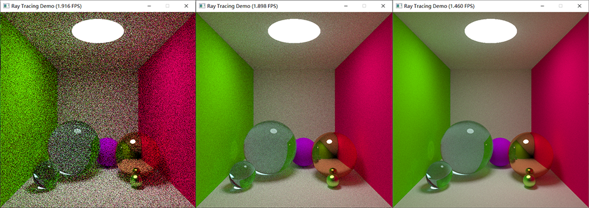

## 项目介绍

本项目使用异构平台编程框架 OpenCL 编写了一个简易的光线追踪渲染器，使用 GPU 并行计算的能力加速计算每个像素点的颜色，并通过 OpenGL 图形库将 OpenCL 计算出的每个像素点的颜色渲染到屏幕上。

主要编程语言使用 C/C++ 以及 OpenCL，同时包含极少的 GLSL 着色器语言。


## 具体实现

### OpenCL 与 OpenGL 交互

如果使用 CL 在 GPU 上计算出所有像素的颜色，再传输回 CPU，通过 CPU 再交给 GL 渲染就多此一举了。解决方法是，GL 可以在显存上直接申请一片内存用于存储材质，CL 使用 GL 申请的内存进行计算和存储，最终再由 GL 使用这片显存上的数据进行绘制，以此完成 CL 与 GL 的交互使用。

```cpp
glGenBuffers(1, &pbo);
glBindBuffer(GL_ARRAY_BUFFER, pbo);
glBufferData(GL_ARRAY_BUFFER, winWidth * winHeight * sizeof(cl_uint),NULL, GL_STATIC_DRAW);
glBindBuffer(GL_ARRAY_BUFFER, 0);

outBuffer = clCreateFromGLBuffer(context, CL_MEM_READ_WRITE, pbo, &err);
if (err != CL_SUCCESS) {
    std::cerr << "Couldn't create buffer from the PBO: " << TranslateOpenCLError(err) << std::endl;
    return;
}
```

如上述代码所示，首先由 GL 申请窗口大小的 PBO(Pixel Buffer Object)，其中该 Buffer 的每一个元素都是一个无符号四字节整型，分别对应 RGBA 四个通道，每个通道使用一个字节，所以颜色范围是 0~255。

然后 CL 可以通过 clCreateFromGLBuffer 方法来从一块 GL 申请的内存上创建内存对象。该内存对象在后续会被传入到内核之中，用来存储 CL 计算得出的每个像素的颜色。

与其他要传入内核的参数不同的是，通过 GL 创建的内存对象需要从 GL 手中抢走控制权，所以在运行内核之前，需要额外插入以下代码。

```cpp
glFinish();
err = clEnqueueAcquireGLObjects(queue, 1, &outBuffer, 0, NULL, NULL);
if (err != CL_SUCCESS) {
    std::cerr << "Couldn't acquire the GL object" << std::endl;
    return;
}
```

同时，在运行结束之后也需要释放 OpenCL 对 GL 内存对象的控制权。

```cpp
clEnqueueReleaseGLObjects(queue, 1, &outBuffer, 0, NULL, NULL);
```


### OpenGL 的使用

把 PBO 绘制到屏幕上还需要一些步骤。

首先需要从 PBO 生成出一张材质，或者说把材质绑定到 PBO 上。

```cpp
glBindBuffer(GL_PIXEL_UNPACK_BUFFER, pbo);
glTexImage2D(GL_TEXTURE_2D, 0, GL_RGBA, winWidth, winHeight,0, GL_RGBA, GL_UNSIGNED_BYTE, 0);
glActiveTexture(GL_TEXTURE0);
```

材质需要经过 GL 的渲染流水线，也就是光栅化、顶点着色器和片段着色器等步骤才能输出到窗体。为此需要自己编写着色器代码。

这个部分比较简单，顶点着色器只需要把坐标变换成材质上的 uv 坐标即可。

```glsl
#version 130
in  vec3 in_coords;
in  vec2 in_texcoords;
void main(void) {
   gl_TexCoord[0].st = in_texcoords;
   gl_Position = vec4(in_coords, 1.0);
}
```

片段着色器只需要返回材质在该坐标的颜色即可。

```glsl
uniform sampler2D tex;
out vec4 new_color;
void main() {
   vec3 color = vec3(texture(tex, gl_TexCoord[0].st));
   new_color = vec4(color, 1.0);
}
```

这些着色器代码需要由 GL 在运行时编译，同时材质在屏幕上的顶点坐标等信息也需要硬编码一下。

这部分完成之后，就只需要关心 CL 是如何求得每个像素上的颜色的了。


### CPU 与 GPU 之间的数据传输

为了简单起见，假设渲染的场景中所有的物体都是球。

渲染一个三维场景，我们需要知道摄像机、每个球的位置以及每个球的材质。这些信息需要我们在主机上定义，然后传输到显卡设备上。

由于 CL 并不自带随机数发生器，所以也需要由主机设备生成一个随机种子传到 GPU 上。

渲染的过程并不是只运行一次内核的，而是要不断运行，把结果叠加起来，计算方法为
$$
c_{t,i,j}=\sqrt \frac{s_{i,j}}{t}
$$
其中 $c_{t,i,j}$ 表示第 $t$ 帧时屏幕上 $(i,j)$ 像素应该显示的颜色，$s_{i,j}$ 表示 $[1,t]$ 帧由 CL 算出来的 $(i,j)$ 像素的颜色之和。

上述式子中，$i,j$ 可以由工作组的序号获得，但 $s$ 和 $t$ 不行，所以这些信息也要一并传入。

#### 摄像机

```cpp
struct Camera {
	cl_double theta;
	cl_double winWidth;
	cl_double winHeight;
	cl_double3 __declspec(align(32)) pos; // 屏幕中心点的位置
	cl_double3 up;
	cl_double3 lookAt;
};
```

为了能将物体画在屏幕上，我们需要对屏幕（或者说摄像机）有个准确的定义。除了宽度和高度之外，还需要知道屏幕中心在三维空间中对应的坐标。还需要设定视角，通过 $\frac{h}{2} \div \tan(\frac{\theta}{2})$ 就能计算出出摄像机距离屏幕的距离，这个参数会影响到透视的程度，直观地理解就是“广角”的程度。最后还需要两个方向向量以此来确定摄像机在空间中的旋转方向。

#### 材质

```cpp
struct Material {
	cl_double refraction;
	cl_double reflection;
	/*
	* 0: light
	* 1: diffuse
	* 2: metal
	* 3: dieletric
	* 4: fuzz metal
	*/
	cl_int type;
	cl_double3 __declspec(align(32)) color;
};
```

材质定义了物体的材质类型、折射率、反射率和颜色等信息。不同的材质在后续光线追踪中的行为会有所不同。

#### 物体

```cpp
struct Sphere {
	cl_double radius;
	cl_double3 __declspec(align(32)) pos;
	Material mat;
};
```

我们假定空间中只有球，对于一个球只需要通过空间中的坐标和半径就能定义了，除此之外每个球都有它独特的材质。

#### 内存对齐

CL 其实已经在头文件中已经为每种基本数据类型定义好了该如何进行内存对齐，但遗憾的是 MSVC 并不支持，所以内存对齐需要我们手动来操控，否则 GPU 读取数据时就会发生错位。CL 规定大小为 $k$ 字节的基本类型，起始地址应该是 $k$ 的倍数。使用 `__declspec(align(32))` 来表明该变量在内存中的起始地址应该是 $32$ 的倍数。


### OpenCL 实现光线追踪

本项目中，屏幕窗口的大小是 $800\times 800$ 像素，很自然的把任务划分成两个维度，分别是行和列。对于 GPU 上每一个单独的处理器来说，要解决的就是计算某个像素点的颜色。

利用光线追踪技术计算该像素点的颜色，可以从设定好的摄像机发射一条射线，与事先定义在空间中的球求交，求出第一个交点。如果这样的交点不存在，则射线打入了虚空中，像素的颜色为黑色。如果交点位于光源上，则返回光源的颜色。否则，根据交点所在的球的材质，进行不同的反射/折射行为，这是一个递归的过程。

实际计算中，不可能遇到漫反射就发射好多条反射光线，遇到折射就同时发射折射光和反射光，因为经过若干次反射后，单条光线可能会变成数千条光线，这即使是在 GPU 上也是不可接受的高复杂度。所以转变成概率的形式，以某概率反射某光线，然后进行多次采样，就能达到类似的目的了。

#### 射线与球面求交

内核函数中，使用起始点和方向向量来定义三维空间中的一条射线，如下定义

```cpp
typedef struct Ray {
	double3 pos;
	double3 dir;
} Ray;
```

起点在 $p_r$ 且方向向量为 $d$ 的射线上每一个点可以表示成 $p_r+k d(k\gt 0)$ 。

球心在 $p_s$ 且半径为 $r$ 的球面上每一个点 $p$ 可以由隐函数 $\Vert p-p_s \Vert = r$ 确定。

联立方程可以得到一个只与 $k$ 相关的一元二次方程，若 $\Delta \lt 0$ 则无交点，若两解都不是正数则也无交点，否则找到最小的正数解 $k^\prime$ ，那么 $p_r+k^\prime d$ 就是射线与该球的第一个交点。

遍历空间中每个球，就可以计算出空间中射线与所有球的第一个交点。

#### 镜面反射

入射角等于反射角，设入射光的方向向量为 $i$ ，法向量为 $n$ ，且都是单位向量，那么反射光的方向向量为
$$
i-2(i\cdot n)n
$$
如果材质为 Fuzz metal ，则不是一个纯的镜面反射，需要在反射方向上加一个小的随机扰动。

#### 漫反射

随机在法向量所在的半空间选择一个方向发射反射光线，每个方向被选择到的概率正比于该方向与该面的法向量的夹角的正弦值。换句话说就是和法向量相同方向的概率最大，垂直于法向量方向的概率最小。

为了保证随机满足这样的一个分布，可以在法向量上往外一单位距离为球心画一个单位球，然后用蒙特卡洛在单位球内随机一个点，与交点连接，这样得到的随机向量就是满足分布的，证明略。

<center>
    
    <br>
</center>

#### 折射

可以利用斯涅尔定律来计算折射角度，设 $n_1,n_2$ 分别是入射和折射材质的反射率，$\theta_i,\theta_t$ 分别是入射角和折射角，那么它们之间的关系应该满足下式
$$
n_1 \sin(\theta_i)=n_2 \sin(\theta_t)
$$

<center>
    
    <br>
</center>

特殊地，如果 $\frac{n_1}{n_2}\sin(\theta_i) \gt 1$ 则说明不会发生折射。 

光线打到透明材质表面时，并不是只发生折射的，同时也会发生反射，而折射和反射的占比取决于入射角。就好比站在水面附近垂直往下看，是能看到水底的，但从远距离斜视，就是能看到它反射了天空。这个现象通过菲涅尔公式来计算。
$$
R_s=(\frac{n_1 \cos(\theta_i)-n_2 \cos(\theta_t)}{n_1 \cos(\theta_i)+n_2 \cos(\theta_t)})^2\\
R_p=(\frac{n_1 \cos(\theta_t)-n_2 \cos(\theta_i)}{n_1 \cos(\theta_t)+n_2 \cos(\theta_i)})^2
$$
其中 $R_s$ 是折射的权重，$R_p$ 是反射的权重。

在 GPU 中计算这个式子太耗时了，所以一般使用 Schlick 近似来算
$$
R(\theta_i)=R_0+(1-R_0)(1-\cos(\theta_i))^5\\
R_0=(\frac{n_1-n_2}{n_1+n_2})^2
$$
运行过程中，遇到折射时可以随机一个 $[0,1]$ 的数 $x$，如果 $x \lt R_0$ 则发生反射，否则发生折射。

#### 尾递归优化

对于 CL 来说，内核上的所有函数其实都是内联的，这就导致了不能在内核里写递归函数，需要手动写一个栈把递归展开成循环。幸运的是上述过程是颜色的叠加，可以转变一下思想把每次反射看做是颜色的过滤，这样就能写成尾递归的形式，不需要额外的栈空间了。

#### 迭代次数

如果光线无止境地反射下去，那复杂度也是不能接受的，通常有两种机制来限制。一种是直接限制光线反射的次数，假定一条光线反射超过了若干次，比如说是 $10$ 次，那么就认为光线不会打到光源上，直接返回黑色。另一种方法采用了俄罗斯轮盘赌的思想，每次反射由一定概率，比如说 $20 \%$ 的概率会无法继续反射下去，这样一定程度上也控制了光线最大的反射次数。本项目中采用了两种方法的结合。 


## 运行结果

由于本项目中光线反射的方法是基于概率和采样，所以一定会有噪点。下图展示了程序的运行结果，分别是运行了一分钟、五分钟和一小时的效果，可以看出随着时间的增加，图片中的噪点明显地变少了，效果看起来也更加的真实。

<center>
    
    <br>
</center>


运行在Intel集成显卡上，大概能达到的效率为 $1.5$ 帧每秒左右，每帧的运算量大约在像素点数量乘以光追的深度也就是 $800\times800\times10$ 左右。


## 不足与改进方案

在光线与球面求交时，其实很多球和光线不会有交点，可以利用 $K$-D 树之类的空间数据结构来预先筛选出可能与光线有交的球面，以达到加速的效果。

同时，该实现中所有浮点类型均采用了双精度浮点，高达 $8$ 个字节，在非坐标相关的计算上是非常没有必要的。大量的双精度浮点运算可能使运行速度有非常明显的下降。

等待噪点消失的时间过于漫长，可以结合其他方法来对图像进行去噪可以加快渲染速度。


## 附录

### 参考资料

1. [Taichi Course 01](https://github.com/taichiCourse01/taichiCourse01)

2. [Taichi Ray Tracing](https://github.com/taichiCourse01/taichi_ray_tracing)

3. [Ray Tracing in One Weekend](https://raytracing.github.io)

4. [OpenCL-path-tracing-tutorial-3-Part-1](https://github.com/straaljager/OpenCL-path-tracing-tutorial-3-Part-1)

### 开发环境

1. OpenCL: Intel SDK 7.0.0.4443

2. OpenGL: 4.5

3. Windows10 Visual Studio 2019

### 代码仓库

[Github](https://github.com/SetsunaChyan/RayTracingDemo)
